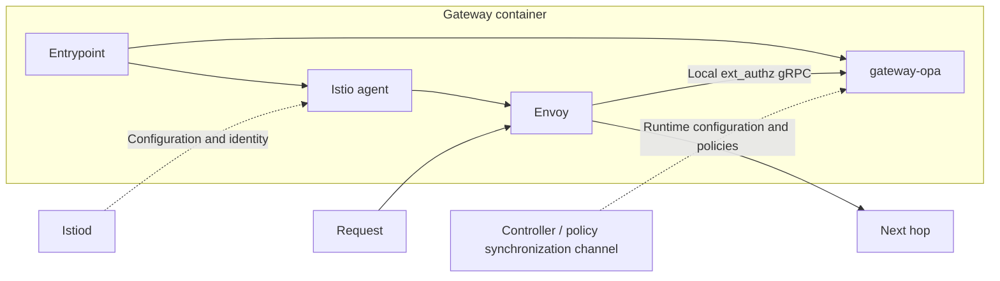

# Architecture and responsibilities

A single Go module builds the custom OPA executable, `gateway-opa`, and registers the Envoy authorization plugin through official OPA interfaces. The scaffold maintains no OPA fork and introduces no dynamic `.so` plugin mechanism.

In the default `istio` mode, `pilot-agent` starts Envoy using the upstream bootstrap and identity mechanisms. Local `standalone` mode starts the image's Envoy directly with mounted static configuration; it provides neither mesh identity nor Pod egress interception.

The OPA and proxy child processes form one runtime unit. If either long-running child exits, the entrypoint stops the other and exits with a nonzero status. When the container receives TERM or INT, it sends TERM to both children and waits for them to exit. The container platform remains responsible for forced termination after its timeout.

| Owner | Responsibilities |
|---|---|
| gateway | OPA plugin assembly, protocol and identity adaptation, enforcement results, image |
| policy | Public semantic types, baseline Rego, shared test fixtures |
| controller | CR watches, bindings, policy generation and publication, target configuration, status aggregation |
| Istio | Identity, certificates, routing, and proxy configuration |
| External workload manager | Creation, replacement, and deletion of application Pods |

Workload Proxy and Egress Gateway use the same image. The full contract requires the former to enforce the baseline and the latter to independently recheck it using trusted source identity before enforcing egress policy. This scaffold only verifies that both authorization stages are connected and can deny independently. Shared policy composition and ServiceAccount binding are not yet implemented.

The synchronization mechanism, such as native bundle long polling or OPAL, has not been selected; the scaffold deploys no synchronization control plane. Upstream OPA management capabilities remain available. Component tests update fixture policies over REST only to verify that runtime decisions change; this does not select REST push as the production synchronization mechanism.

References: [Controller Scope](https://github.com/egress-gateway/egress-gateway-controller/wiki/Controller-Scope-and-Contract), [CRD Design](https://github.com/egress-gateway/egress-gateway-controller/wiki/GatewayProfile-CRD-Design).
